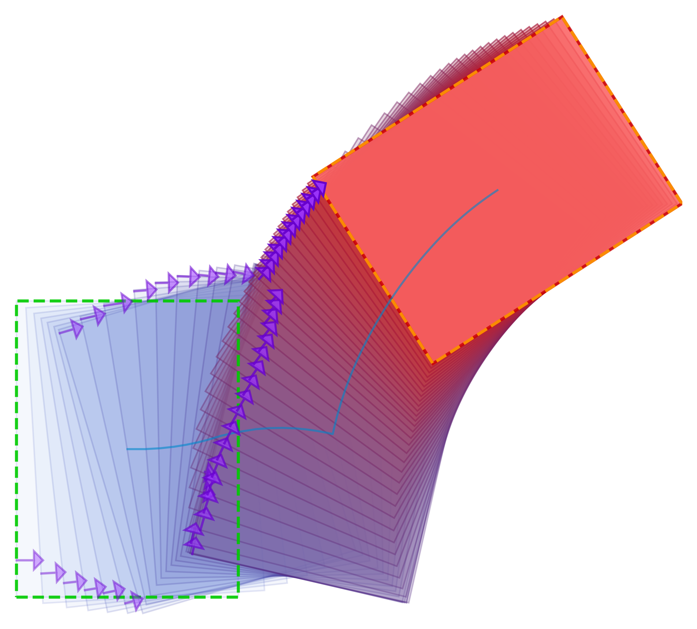
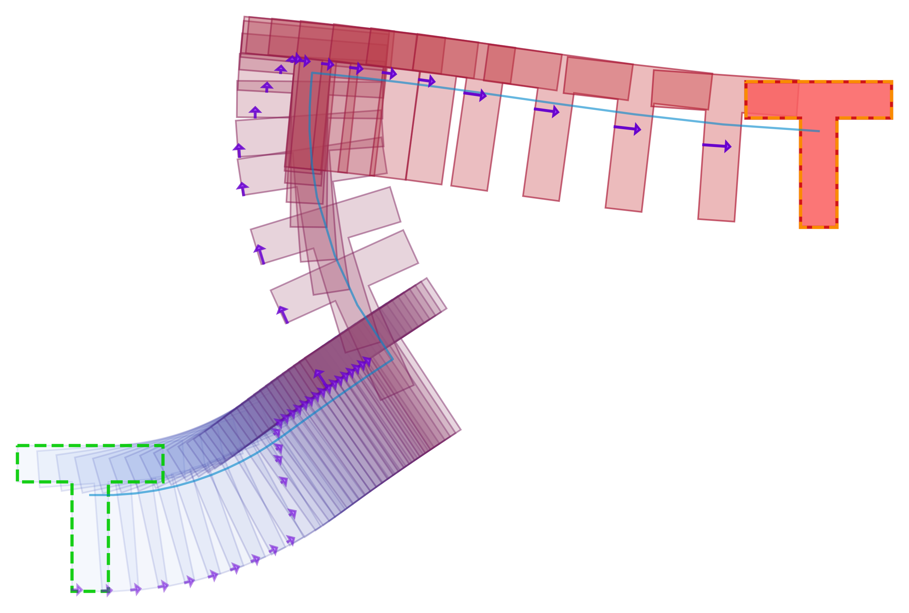
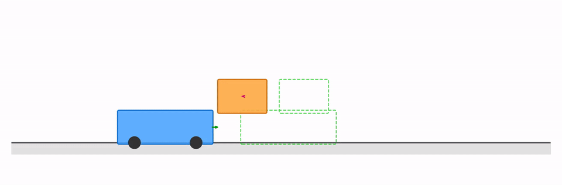

# IMPACT

IMPACT is an augmented-Lagrangian / block-coordinate-descent solver for
**MPCCs** (Mathematical Programs with Complementarity Constraints). The code in
this repository is mainly organized around contact-implicit trajectory
optimization, but the solver can also be used on an MPCC with a sum-of-squares
objective.

<p align="center">
  <a href="https://jonaspflaume.github.io/impact_info/">
    
  </a>
  <a href="https://arxiv.org/abs/2605.09127">
    
  </a>
  <a href="#citation">
    
  </a>
</p>

<p align="center">
  <b><a href="https://jonaspflaume.github.io/impact_info/">IMPACT: An Implicit Active-Set Augmented Lagrangian for Fast Contact-Implicit Trajectory Optimization</a></b>
  <br>
  Jiayun Li, Dejian Gong, Georgia Chalvatzaki. RSS 2026. (<a href="#citation">cite below</a>)
</p>

<p align="center">
  
  &nbsp;&nbsp;
  
</p>
<p align="center">
  
</p>

The solver code is shared across all examples. A task supplies the symbolic
problem data, then a shooting builder assembles the MPCC passed to
`AulaSolver`. The CITO experiments in the paper use the multiple-shooting
front-end.

## Python

`pip install .` builds the solver and installs it as a Python package. Models are
written in Python with the CasADi Python API; only the augmented-Lagrangian solve
runs in C++.

```bash
pip install .            # solver only
pip install '.[all]'     # + MuJoCo simulation, visualizers, tests
```

Two packages live under `python/`, and the split is the point:

| | what it is | installed by `pip install .`? |
|---|---|---|
| `impact` | the solver: generic MPCC assembly, both shooting transcriptions, the AuLa solve. **Knows no tasks.** | yes |
| `examples` | this repository's task models, tuned settings, drivers and visualizers | no — repository material |

```python
import numpy as np
import casadi as ca
from impact import AulaConfig, BlockOptions, MPCCDescription, Solver, build_mpcc

#   minimize ||z - [0.8, 0.2]||^2   s.t.   0 <= z1 (perp) z2 >= 0
z = ca.SX.sym("z", 2)
desc = MPCCDescription(z=z, cost=z - ca.DM([0.8, 0.2]), cost_is_linear=True)
desc.add_complementarity("pair", z[0], z[1], BlockOptions(tol=1e-8))

result = Solver().solve(build_mpcc(desc).subproblem, AulaConfig(), np.zeros(2))
print(result.z, result.converged)
```

For a trajectory problem, describe one stage as an `impact.MPCCProblem` (explicit
ODE) or an `impact.LCPProblem` (contact) and hand it to a shooting front-end:

```python
solution = MultipleShootingSolver(MyTask()).solve(config)
solution.state_trajectory        # nx x (horizon + 1)
```

### Running the example tasks

Everything task-specific lives in [`python/examples/`](python/examples/), one
directory per example — `task.py` (the model and its tuned config), `viz.py` (how
to draw it) and `main.py` (the command line). Nothing registers them: `run.py`
lists the directories that have a `main.py`, so adding an example is adding a
directory.

```bash
python python/examples/run.py list                     # every example, with its summary
python python/examples/run.py push_t --visualize       # solve, save, render
python python/examples/run.py push_circle --distance 1.5 --angle 225 --horizon 100
python python/examples/run.py box --start 0 0 0 --goal 0.1 0.1 1.0 --tol 1e-6
python python/examples/run.py allegro --object cube --max-steps 100 --render
python python/examples/run.py push_circle --render-only   # newest trajectory -> GIF
python python/examples/run.py push_circle --print-config  # the tuned settings, as JSON
```

Every example is equally runnable on its own —
`python python/examples/push_t/main.py --visualize` is the same run as
`run.py push_t --visualize`. `python -m examples.run ...` also works wherever
`python/` is on the import path (an editable install, or running from inside
`python/`). The path form above works regardless, so it is the one quoted
throughout.

or from Python, where a task's `solve()` is the whole API:

```python
from examples.push_circle.task import config, solve

cfg = config(horizon=100)
cfg.rho_max = 400.0
result = solve(cfg)
print(result.summary())
result.save()              # results/push_circle/bcd_aula/trajectory_<ms>.txt

from examples.push_circle.viz import render
render(result.path)        # results/push_circle/push_circle.gif
```

A guided tour of the whole Python surface is in
[`python/examples/notebooks/push_circle.ipynb`](python/examples/notebooks/push_circle.ipynb).

**How the split works.** Python derives the augmented-Lagrangian residual and
its Jacobian as CasADi functions, then
hands them to the solver in CasADi's own serialized form together with the block
offsets it chose. Nothing symbolic is built in C++, and no CasADi type appears in
the binding signatures. The extension links the `libcasadi` that ships inside the
`casadi` wheel, so both sides of that boundary are the same library build by
construction rather than by version negotiation.

`python/tests/test_parity.py` pins the port: for every task, both shooting
transcriptions and both inner solvers, the Python-built residual and Jacobian are
compared against the C++ builders' at random points and must agree **to the last
bit**. Writing your own task means subclassing `impact.MPCCProblem` (explicit
ODE), `impact.LCPProblem` (contact), or building an `impact.MPCCDescription`
directly — `python/examples/box/task.py`, `allegro/task.py` and `toy/task.py` are
one of each.

Solver hyper-parameters are the C++ `AulaConfig` struct itself, exposed field for
field (`impact.config_to_dict(AulaConfig())` lists all 60), so the Python defaults
are the solver's defaults and cannot drift.

## Build (C++ drivers)

Dependencies: CMake ≥ 3.15, Eigen3, CasADi, BLAS/LAPACK. The Allegro demo also
needs MuJoCo and GLFW.

For a self-contained demo, the quickest path is the Docker image. It installs the
Python bindings, solves Push-T, and renders the trajectory it found:

```bash
docker build -t impact .

# Solve Push-T and render the result into ./results/push_t/
mkdir -p results
docker run --rm -v "$PWD/results:/workspace/impact/results" impact

# Any other task, same image
docker run --rm -v "$PWD/results:/workspace/impact/results" impact run box --visualize
docker run --rm impact run list
```

The image builds only the Python extension — no C++ driver executables, no
MuJoCo, no GLFW — so it stays small and works on x86_64 and arm64 alike. Run
`docker run --rm impact help` to see all wrapper commands.

Whatever the container writes into the mounted `results/` directory comes back
owned by you rather than by root: the entry point reads the owner of the mount
point and applies it to everything underneath on the way out. Creating
`results/` before the run is what gives it an owner to read — a path Docker has
to create itself is made root-owned on the host.

```bash
cmake -S . -B build -DCMAKE_BUILD_TYPE=Release
cmake --build build -j

# Smallest example
./build/experiments/toy_mpcc/toy_mpcc
```

To build the component tests, configure with `-DIMPACT_BUILD_TESTS=ON` and run
`ctest --test-dir build`.

## Layout

```
impact_solver/            solver library (target: impact)
  include/impact/
    stage_problem.h          common per-stage task interface
    mpcc_subproblem.h        buildMPCC(), the direct MPCC assembly entry point
    aula_solver.h            AulaSolver (outer AuLa; inner BCD)
    multiple_shooting.h      builder/front-end for multiple shooting
    single_shooting.h        builder/front-end for single shooting
    mpcc_stage.h, lcp_stage.h
    gauss_newton_solver.h    inner damped Gauss-Newton (LM) X-solver
    complementarity_projection.h, dual_block.h, saddle_layout.h, ...
experiments/              box / push_t / cart_transporter (multiple-shooting MPCC),
                          allegro (single-shooting LCP), toy_mpcc (generic MPCC)
    parity_dump/             dumps a C++-built subproblem for the Python parity test
penalty_solver/, relax_solver/   IPOPT / Scholtes baselines (same problem interface)
simulation/               MuJoCo wrapper (allegro)
resources/                allegro MuJoCo models

python/
  src/bindings.cpp        pybind11 module (solver only; no CasADi in any signature)
  impact/                 THE SOLVER -- installed by pip; contains no task
    mpcc.py                 build_mpcc(): the Python side of buildMPCC()
    shooting.py             multiple/single shooting builders + front-ends
    stage.py                StageProblem / MPCCProblem / LCPProblem + adapters
    config.py               AulaConfig as data (to/from dict, keyword apply)
    report.py               planner tags, the RESULT line, tolerance coupling
  examples/               THE TASKS -- repository material, not installed
    run.py                  dispatcher; finds examples by looking, registers nothing
    <example>/              one directory per example:
      task.py                 the model, its tuned AulaConfig, solve()
      viz.py                  how to draw a saved trajectory of it
      main.py                 the command line -- runnable on its own
    toy, push_circle, box, push_t, cart_transporter,
    allegro (+ sim.py, MuJoCo)
    common/                 trajectory format, shared CLI flags, Result
    notebooks/              push_circle.ipynb, the guided tour
  tests/                  parity against the C++ builders + task regressions
```

Pipeline: `StageProblem` → `build{Single,Multiple}Shooting` → `buildMPCC` →
`AulaSubproblem` → `AulaSolver`. Trajectory problems normally go through one
of the shooting builders. A non-trajectory MPCC can call `buildMPCC` directly.

## Experiments

**Planar tasks.** Pass the initial state followed by the goal state (disk
pushing instead takes the scenario parameters shown below). By default,
the trajectory is written under `results/<task>/bcd_aula/`; most binaries also
accept an explicit output path as the final argument.

For the CITO experiments in the paper, use the multiple-shooting binaries:
`*_impact_multiple`. In this transcription, the state trajectory is free and
dynamics are enforced as defect constraints. Single shooting is also implemented
for comparison purposes.

```bash
# box pushing       state = [px, py, theta]
./build/experiments/box/box_impact_multiple                            0 0 0   0.1 0.1 1.0
# push-T            state = [px, py, theta]
./build/experiments/push_t/push_t_impact_multiple                     0 0 0   0.05 0.05 1.5708
# cart transporter  state = [x1, x2, x1dot, x2dot]   (horizon 300)
./build/experiments/cart_transporter/cart_transporter_impact_multiple  0 0 0 0   1 0 0 0
# disk pushing      state = [qx, qy, sx, sy], control = [fn, ft, vx, vy]
#                   args: D angle_deg [horizon] [out] (pusher start doubles as the disk goal)
./build/experiments/push_circle/push_circle_impact_multiple            1.5 225 120
# disk pushing, single-shooting comparison (same arguments/output format)
./build/experiments/push_circle/push_circle_impact_single              1.5 225 120
```

The `*_penalty` (IPOPT) and `*_relaxation` (Scholtes) binaries are baselines and
take the same arguments. The Python visualizers live next to each task:
`experiments/<task>/<task>_visual.py` (the disk-pushing one also renders a GIF:
`python3 experiments/push_circle/push_circle_visual.py results/push_circle/bcd_aula/trajectory_*.txt --out results/push_circle/push_circle.gif`).

Each visualizer can also be run without paths. It finds the newest
`trajectory_*.txt` recursively under that task's repository-local results
directory and writes its figures/animation to `results/<task>/`, regardless of
the current working directory:

```bash
python3 /path/to/IMPACT/experiments/box/box_visual.py
python3 /path/to/IMPACT/experiments/push_t/push_t_visual.py
python3 /path/to/IMPACT/experiments/cart_transporter/cart_transporter_visual.py
python3 /path/to/IMPACT/experiments/push_circle/push_circle_visual.py
```

**Allegro hand re-orientation.** This is the MuJoCo receding-horizon MPC example
and requires MuJoCo + GLFW:

```bash
./build/experiments/allegro/allegro_impact_single --object cube --seed 0 --render
./build/experiments/allegro/allegro_impact_single --object cube --seed 0 --json   # metrics, headless
```

`--object` ∈ {airplane, binoculars, bowl, bunny, camera, can, cube, cup, elephant,
flashlight, foambrick, light_bulb, mug, piggy_bank, rubber_duck, stick, teapot,
torus, water_bottle}. Other flags: `--seed <n>`, `--save-video <path>` (with
`--render`), `--horizon <h>`, `--max-inner-iters <n>`, `--no-saddle`.

## Numerical scaling

State and control variables can have different physical units and numerical
scales, which may affect convergence speed and require problem-specific tuning.
We are working on making the solver less sensitive to these parameters. If you
have experience with this issue, please feel free to contact Jiayun directly.

## Solve an MPCC

Build the residuals symbolically with CasADi and pass them to `buildMPCC`.
The example below solves
`min (x1-0.5)^2 + (x2-0.5)^2  s.t.  0 ≤ x1 ⊥ x2 ≥ 0`.

```cpp
#include "impact/mpcc_subproblem.h"
#include "impact/aula_solver.h"
using casadi::SX;

SX z = SX::sym("z", 2);
impact::MPCCDescription d;
d.z = z;
d.cost = z - 0.5;              // objective = ||cost||^2
d.cost_is_linear = true;      // residual affine in z (quadratic objective)
// 0 <= z1 ⊥ z2 >= 0   (also: .Equality with .c=h(z),  .Inequality with .c=g(z))
d.constraints.push_back({impact::MPCCConstraint::Complementarity, "comp",
                         /*c=*/SX(), /*G=*/z(0), /*H=*/z(1),
                         /*scale=*/1.0, /*rho_init=*/1.0, /*tol=*/1e-8});

impact::MPCCSubproblem mpcc = impact::buildMPCC(d);
impact::AulaConfig cfg;            // tweak rho_scale, tolerances, use_saddle, ...
Eigen::VectorXd z0(2); z0 << 0.6, 0.4;
impact::AulaResult r = impact::AulaSolver().solve(*mpcc.sub, cfg, z0);
// r.z, r.objective_value, r.converged, r.complementarity_violation
```

`p` (runtime parameters) lets the same symbolic problem be re-solved with new data
(for example, contact Jacobians at each MPC step). Write the parameter vector at
`mpcc.off_p` before solving. See `experiments/toy_mpcc/toy_mpcc.cpp` for a full
runnable version, and the shooting front-ends (`MultipleShootingSolver` /
`SingleShootingSolver`) for trajectory tasks.

## License

This code is released under the MIT License. See `LICENSE`.

## Citation

```bibtex
@inproceedings{li2026impact,
  title        = {{IMPACT}: An Implicit Active-Set Augmented Lagrangian for
                  Fast Contact-Implicit Trajectory Optimization},
  author       = {Li, Jiayun and Gong, Dejian and Chalvatzaki, Georgia},
  booktitle    = {Proceedings of Robotics: Science and Systems ({RSS})},
  year         = {2026},
  note         = {To appear},
  eprint       = {2605.09127},
  archivePrefix = {arXiv},
  primaryClass = {cs.RO},
  doi          = {10.48550/arXiv.2605.09127}
}
```
